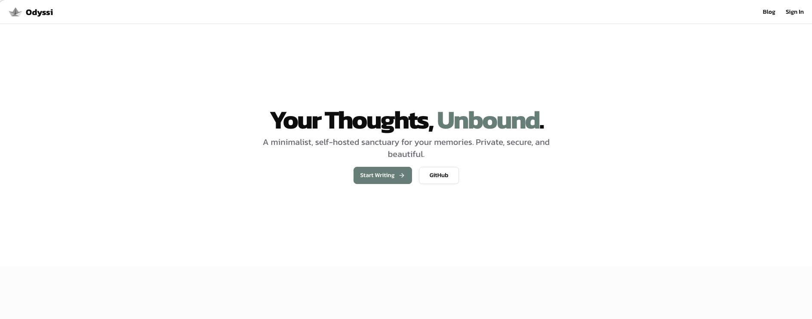
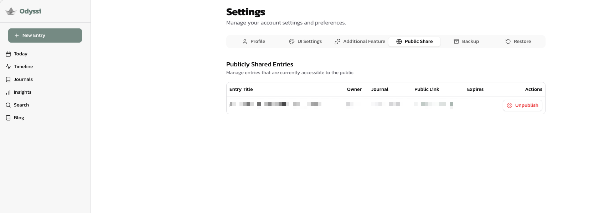

# Odyssi

Odyssi is a minimalist, self-hosted sanctuary for your memories. Private, secure, and beautiful.

## Features

- **Private & Secure:** Self-hosted data ownership. No tracking, no ads.
- **Rich Text Editor:** Write beautiful entries with Tiptap editor support.
- **Visual Calendar:** View your memories in a calendar view with photo thumbnails.
- **Multiple Journals:** Organize your life into different journals (e.g., Personal, Work, Travel).
- **Smart Defaults:** Set a default journal for quick entry creation.
- **Insights Dashboard:** diverse analytics including streaks and mood tracking.
- **Blogging:** Optional public blog to share selected thoughts with the world.

## Screenshots

<p align="center">
  
  
  
</p>


## Tech Stack

- **Framework:** Next.js 15 (App Router)
- **Database:** PostgreSQL with Prisma ORM
- **Auth:** NextAuth.js (v5)
- **UI:** Tailwind CSS, Shadcn command/ui
- **Deployment:** Docker & Docker Compose

## Getting Started

1.  **Clone the repository:**
    ```bash
    git clone https://github.com/your-username/odyssi.git
    cd odyssi
    ```

2.  **Environment Setup:**
    Copy `.env.example` to `.env` and fill in your database credentials and `NEXTAUTH_SECRET`.

3.  **Install Dependencies:**
    ```bash
    npm install
    ```

4.  **Database Migration:**
    ```bash
    npx prisma migrate dev
    ```

5.  **Run Development Server:**
    ```bash
    npm run dev
    ```

## deployment

Use the included `docker-compose.yml` for easy deployment:

```bash
docker-compose up -d --build
```
